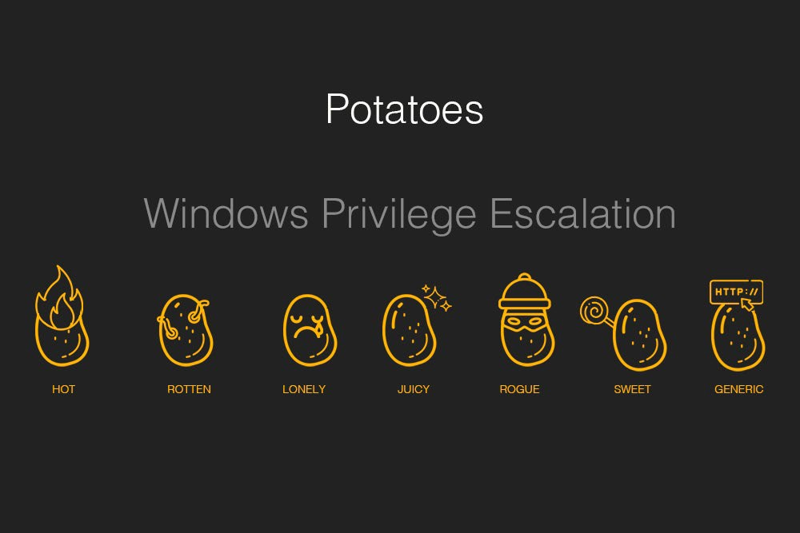
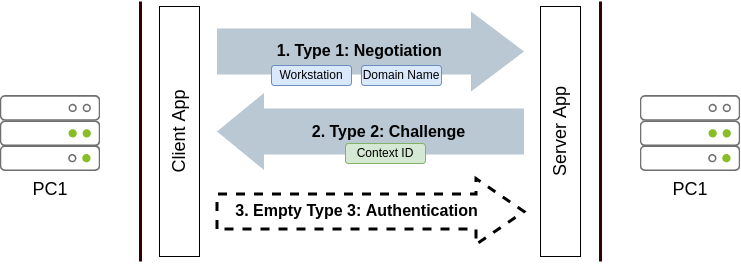
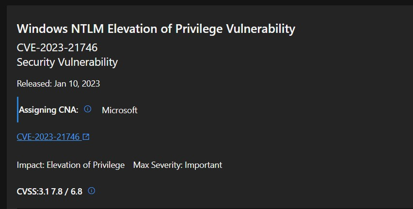
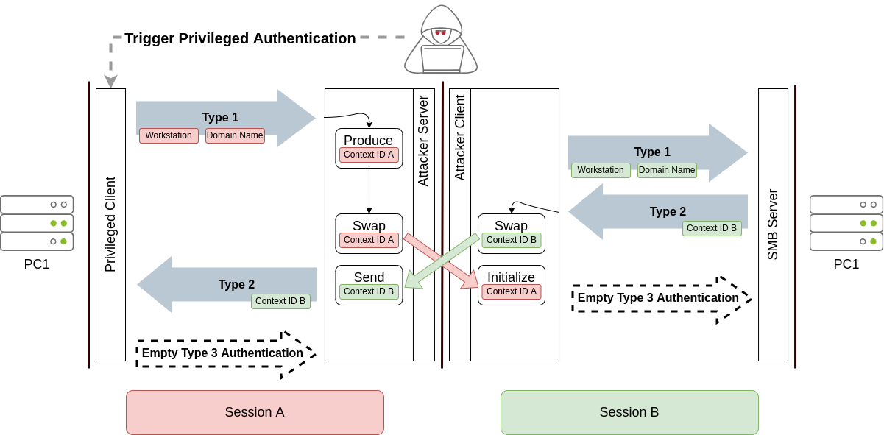
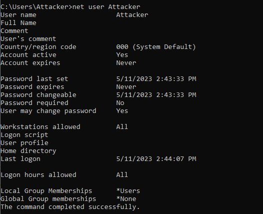
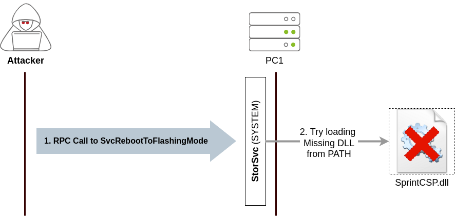
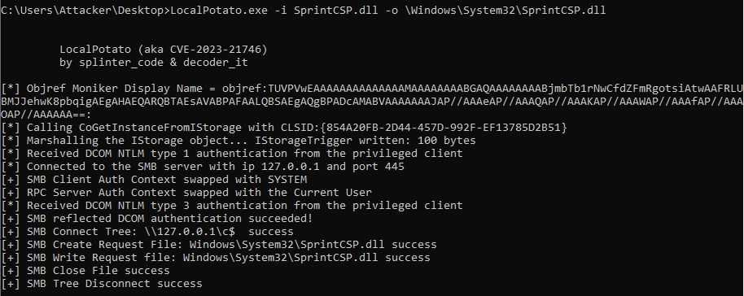

# Exploring Local Potato Exploit to Perform Windows Privilege Escalation

# Background

-   The Hot Potato exploit that emerged in 2016 followed several steps:
-   It first deceived the "NT AUTHORITY\\SYSTEM" account into authenticating itself via NTLM to a TCP endpoint that the exploit controlled.
-   It then intercepted this authentication attempt (a process known as NTLM relay) to locally create a security token for the "NT AUTHORITY\\SYSTEM" account. This was executed using a sequence of Windows API calls.
-   Lastly, it imitated the newly created token. This action is only possible if the attacker's current account holds the privilege to mimic security tokens, which is typically the case for most service accounts but not for most user-level accounts.
-   

# What the Potato?

-   "**Hot Potato**": This vulnerability exploits the Windows NTLM authentication protocol by using man-in-the-middle (MitM) techniques to elevate privileges.
    -   "**Rotten Potato**": This exploit manipulates the NTLM authentication process using a flaw in the DCOM (Distributed Component Object Model) activation service to escalate privileges.
    -   "**Juicy Potato**": It uses a flaw in the DCOM activation service and the BITS (Background Intelligent Transfer Service) to gain SYSTEM privileges from a service account.
    -   "**Sweet Potato**": combines elements from both the Juicy Potato and Rotten Potato exploits for exploiting the Windows RPC (Remote Procedure Call) service.
    -   

NTLM Authentication

-   
-   **The Type 2 Message** involves the server replying to the client with a unique "challenge," a random number, ensuring that client's credentials are not transferred directly over the network.
-   **The Type 3 Message** sees the client responding to the server's challenge by mixing it with their password hash and sending this response back, allowing the server to validate the client's password.
-   

# NTLM Local Authentication

**Type 2 Message:** In this phase, the server forms a Security Context and relays its ID to the client via this message. Using the Security Context ID, the client can now establish a link with the connection.

**Type 3 Message:** Once the client successfully connects with the help of the Security Context ID, it communicates its success back to the server by sending an unpopulated Type 3 message, marking the completion of the local authentication process.

**Link:**<https://msrc.microsoft.com/update-guide/vulnerability/CVE-2023-21746>

# Local Potato

-   
-   As a result, the attacker ends up having a connection that grants him access to any shares with the privileges of the tricked process, including special shares like C\$ or ADMIN\$
-   

# Potato Magic

-   Attacker prompts a privileged process to link to a rogue server they manage, similar to prior Potato exploits.
-   The rogue server sets up Security **Context A** for this privileged connection, but doesn't send it back right away.
-   Concurrently, the attacker introduces a rogue client that connects to the local **SMB Server** using their lower-level credentials.
-   The client starts the connection by sending a **Type 1 message,** to which the server replies with a **Type 2 message** and the ID for a fresh Security **Context B**.
-   The attacker switches the Context IDs between the two connections, causing the privileged process to mistakenly receive the **SMB server's** context.
-   As a result, the privileged client, thinking it's the **SYSTEM**, associates with Security **Context B** of the **SMB connection** created by the attacker, allowing the attacker's client to access network shares with **SYSTEM privileges**.
-   

## Abusing StorSvc to Execute Commands

-   A new avenue for privilege escalation was discovered recently, allowing an attacker to take over a missing DLL to execute arbitrary commands with SYSTEM privileges.
    -   The issue with this approach is that an attacker would need to insert a DLL into the system's PATH to initiate it.
    -   By default, the Windows PATH only includes directories that can be written by privileged accounts.
    -   It may be possible to find systems where specific application installations have changed the PATH variable, making the system vulnerable, but this attack strategy is only applicable to certain situations.
    -   By combining this attack with LocalPotato, we can bypass this limitation and create a fully operational privilege escalation exploit.
    -   
-   First, let’s check what privileges the user has

## LPE via StorSvc

One can send an RPC call to the **SvcRebootToFlashingMode** method provided by the **StorSvc** service, which in turn will end up triggering an attempt to load a missing DLL called SprintCSP.dll.

# Pre-requisites

-   **RpcClient.exe:** This program will trigger the RPC call to SvcRebootToFlashingMode.

Let's begin by modifying **RpcClient.exe***.* As we discussed earlier, the exploit needs to be adjusted based on the target machine's Windows version.

To make these adjustments, we'll need to alter the initial lines of the file located at **storsvc_c.c***.*

**FilePath: C:\\tools\\LPE via StorSvc\\RpcClient\\RpcClient\\storsvc_c.c.**

**SprintCSP.dll:** This is the missing DLL we are going to hijack.

-   To create the SprintCSP.dll, we just need to alter the **DoStuff()** function located at **C:\\tools\\LPE via StorSvc\\SprintCSP\\SprintCSP\\main.c.** This alteration will allow it to perform a command that gives us high-level access to the system.
-   For the sake of simplicity, we'll set the DLL to include our active user into the Administrators group. Above you can see the modified code with our new command.
-   

# Privilege Escalation

-   In order to effectively exploit StorSvc, it's necessary to replicate **SprintCSP.dll** to any directory found within the current PATH. You can confirm the PATH by executing the command below:

-   Therefore, our target will be the **%SystemRoot%\\system32** directory, which corresponds to the file path - **C:\\windows\\system32.**
-   For confirmation, we could attempt to duplicate the DLL directly into system32, but as a user with limited privileges, we won't have the necessary permissions to do so:

-   Through the utilization of **LocalPotato**, we gain the ability to perform arbitrary writes, meaning we can copy SprintCSP.dll into system32 even as an unprivileged user:

-   Now that our DLL is properly positioned, we can execute **RpcClient.exe** to initiate the call to **SvcRebootToFlashingMode**, which in turn activates the payload within our DLL:

-   Now, to check if the exploit works, we can check the user’s privileges to see if the user account has Administrator privileges.

    

# Demo

Detection & Mitigation

#### Security Patches

Staying updated with the security patches helps prevent such attacks.

Microsoft patched the CVE-2023-21746 vulnerability by modifying the way that Windows handles NTLM authentication requests. The vulnerability allowed an attacker with low privileges to elevate their privileges to SYSTEM by sending a specially crafted NTLM authentication request. **The updated code prevents attackers from exploiting the vulnerability by validating the request before processing it**.

#### Least Privilege Principle

Limit user’s access to only perform their job functions.

#### Continuous Monitoring

Creating detection rules like YARA, SIGMA or custom SIEM Rules for continuous monitoring.

# 0(Zero) Patch Software

This does not allow LocalPotato or any other tools to arbitrarily write in to the administrative path without proper privileges

# CVE-2023-21746

The updated code validates the request before processing it by performing the following checks:

-   The request must be from a trusted source.
-   The request must be for a valid user account.
-   The request must contain the correct password.

If any of these checks fail, the request is rejected and the attacker is unable to exploit the vulnerability. Here is a more detailed explanation of each check:

-   The request must be from a trusted source. The updated code checks the source of the request to make sure that it is from a trusted source. This prevents attackers from sending requests from untrusted sources, such as the internet.
-   The request must be for a valid user account. The updated code checks the request to make sure that it is for a valid user account. This prevents attackers from trying to authenticate as a user who does not exist.
-   The request must contain the correct password. The updated code checks the request to make sure that it contains the correct password. This prevents attackers from trying to authenticate with an incorrect password.
    -   

# References

1.  <https://jlajara.gitlab.io/Potatoes_Windows_Privesc>
2.  [https://msrc.microsoft.com/update-guide/vulnerability/CVE-2023-](https://msrc.microsoft.com/update-guide/vulnerability/CVE-2023-21746)

### [21746](https://msrc.microsoft.com/update-guide/vulnerability/CVE-2023-21746)

1.  [https://github.com/blackarrowsec/redteam-](https://github.com/blackarrowsec/redteam-research/tree/master/LPE%20via%20StorSvc) [research/tree/master/LPE%20via%20StorSvc](https://github.com/blackarrowsec/redteam-research/tree/master/LPE%20via%20StorSvc)
2.  [https://decoder.cloud/2023/02/13/localpotato-when-swapping-the-](https://decoder.cloud/2023/02/13/localpotato-when-swapping-the-context-leads-you-to-system/) [context-leads-you-to-system/](https://decoder.cloud/2023/02/13/localpotato-when-swapping-the-context-leads-you-to-system/)
3.  <https://www.localpotato.com/localpotato_html/LocalPotato.html>.
4.  

